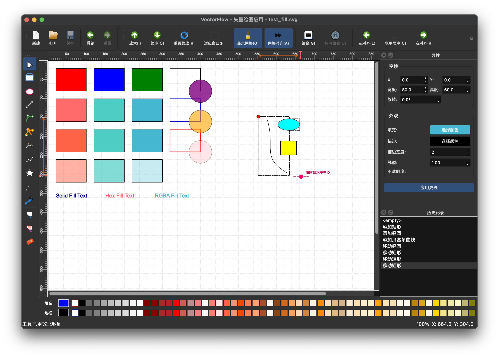

# VectorFlow

VectorFlow 是一个矢量图形编辑器，旨在重写 qdraw 项目并致敬 Inkscape。该项目提供了一个功能丰富且用户友好的界面，用于创建和编辑矢量图形。

## 特性

### 选择与变换工具
- **双模式手柄系统**：支持缩放模式和旋转模式
  - 缩放模式：显示 8 个缩放手柄（4 个角点 + 4 个边缘）
  - 旋转模式：显示 4 个角点旋转手柄和 1 个中心手柄
- **模式切换**：点击选中的图形可在两种模式间切换
- **精确的变换操作**：支持缩放、旋转、移动等操作
- **多选支持**：可同时选择和操作多个图形
- **手柄预览**：变换时显示虚线预览
- **智能吸附**：支持网格吸附和对象吸附

### 绘图工具
- **基础图形工具**：
  - 矩形工具
  - 椭圆工具
  - 多边形工具
  - 线条工具
  - 多段线工具
- **路径工具**：
  - 贝塞尔曲线工具
  - 钢笔工具
  - 路径编辑工具
  - 节点编辑工具
- **填充与描边**：
  - 填充工具
  - 渐变填充工具
  - 画笔工具
  - 橡皮擦工具

### 编辑功能
- **节点编辑**：精确控制路径节点和贝塞尔手柄
- **路径编辑**：合并、分割、简化路径
- **变换操作**：平移、缩放、旋转、倾斜
- **图层管理**：创建、移动、合并图层
- **群组功能**：将多个对象组合或拆分

### 其他功能
- **网格系统**：可自定义网格和对齐
- **标尺与参考线**：辅助精确定位
- **撤销/重做**：完整的操作历史记录
- **文件格式支持**：SVG 导入/导出
- **属性面板**：实时编辑对象属性

## 安装

### 依赖

- Qt 6.x
- CMake 3.16 或更高版本

### 构建

```bash
mkdir build
cd build
cmake ..
make -j4
```

## 使用

1. 启动 VectorFlow 应用程序
2. 使用工具栏选择不同的绘图工具
3. 在画布上绘制或选择现有对象进行编辑
4. 使用选择工具选中对象并进行变换操作
5. 利用各种编辑工具进行精细调整

## 键盘快捷键

- `Ctrl+Z`：撤销
- `Ctrl+Y`：重做
- `Delete`：删除选中图形
- `Ctrl+A`：全选
- `Ctrl+G`：群组
- `Ctrl+U`：取消群组
- `Ctrl++`：放大
- `Ctrl+-`：缩小
- `Ctrl+0`：适合窗口

## 界面预览



## 许可证

本项目采用 MIT 许可证 - 详见 [LICENSE](LICENSE) 文件。

## 贡献

欢迎提交 Issue 和 Pull Request 来帮助改进项目。

## 关键词

矢量图形, SVG编辑器, Inkscape, Qt, C++, 图形设计, 矢量绘图, 开源软件, 图形编辑器, 路径编辑, 节点编辑

## 致谢

VectorFlow 项目受到 Inkscape 的启发，旨在提供一个现代化的矢量图形编辑体验。